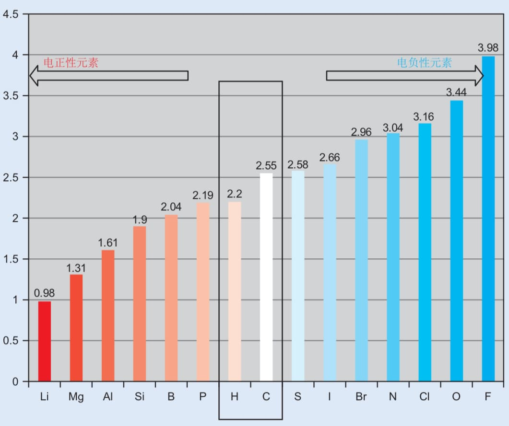

# 原子和元素

## 原子的结构

1. **质子（Proton）**：质子带有正电荷，位于原子核中。质子的数量决定了一个元素的原子序数，并且对元素的化学性质有决定性影响。
2. **中子（Neutron）**：中子不带电，和质子一样，也位于原子核中。中子的数量会影响原子的质量和稳定性，但不影响元素的化学性质。
3. **电子（Electron）**：电子带负电荷，围绕原子核运动。电子的数量通常与质子相等，这样原子整体呈中性。

### 概念辨析

* 原子核中质子和中子的数量称为**质量数**
* 质子的数量则是原子的**原子序数**
* 原子序数决定了**元素的种类**
* 质子和中子的组合形态可以形成不同的**同位素**（因为是在元素周期表中同一个位置）

### 电中性的原子中

* 质子数等于电子数
* 电子的负电荷正好抵消了质子的正电荷
* 如果原子失去或获得电子，它就会变成带电的离子

## 元素

* 元素是由具有相同质子数的原子构成的物质
* 元素是化学物质最基本的组成单位
* 每种元素的所有原子都有相同数量的质子
* 元素的种类决定了其化学性质和物理性质

## 元素周期表

### 按原子序数排列的表格

* 每一行称为**周期**
* 每一列称为**族**
* 元素周期表展示了元素之间的周期性变化规律

### 所有元素分为三类

* **金属**：金属位于元素周期表的左侧和中部，通常具有良好的导电性、导热性和延展性。常见的金属包括铁、铜、铝等。
* **非金属**：非金属位于周期表的右侧，通常具有较低的熔点和沸点，且不导电。常见的非金属包括氧、氮、氯等。
* **类金属**：半金属位于金属和非金属之间，它们在某些条件下表现出金属的性质，而在其他条件下则表现出非金属的性质。例如硅、砷。

**类金属**又译**半金属**，但为了精确区别这类元素的性质，术语**半金属**对应的英语应为 **semimetal** 或 **half-metal**；前者在能带理论中，是指导带和价带之间相隔很窄的材料；后者在自旋电子学中，是指对于自旋为某一方向的电子表现为导体，但是对于自旋为另一方向的电子表现为半导体或绝缘体的材料，或详称**自旋半金属**。

### 周期性的变化

元素周期表中，随着元素的序数增加，它们的电子结构也呈现出周期性的变化。每个周期内，元素的化学性质逐渐变化，表现为：

* **从左到右**：元素的电负性（吸引电子的能力）逐渐增大，原子半径减小，金属性降低。
* **从上到下**：元素的电负性逐渐减小，原子半径增大，金属性增强。

例如，碱金属（如钠、钾）在化学反应中非常活泼，它们倾向于失去一个电子形成阳离子。相比之下，贵金属（如金、银）则非常稳定，不容易发生化学反应。


## 原子发生化学反应

化学反应主要由原子的电子参与。原子通过转移电子来形成化学键。根据电子的配置，原子会倾向于以某种特定的方式与其他原子结合，形成分子或化合物。

* **离子键**：当一个原子失去电子，另一个原子获得电子时，它们形成离子键。典型的例子是钠和氯反应形成氯化钠（NaCl）。
* **共价键**：当两个原子共享电子时，它们形成共价键。例如，氢气分子（H-H）中的两个氢原子通过共享电子形成共价键。
* **金属键**：金属原子之间的键合是通过**自由电子**形成的，这些电子能够自由流动，赋予金属良好的导电性。

## 四个量子数

对原子描述更加精确的方法还有量子力学，可能或多或少听过这个词，它没有那么遥不可及，我们也可以了解一二的。它的基本内容之一是描述粒子状态的**量子数**。

对于电子在原子中的运动，**量子数**用来描述电子的不同性质，包括电子的能量、角动量、轨道形状、方向等。总共有**四个量子数**，它们共同确定了电子在原子中的状态。

### 主量子数

主量子数 $n$ 描述的是电子所在的**能层**。它决定了电子的平均距离与原子核之间的距离。主量子数可以是任何正整数，即（ $n = 1, 2, 3, \dots$ ）数值越大，电子的能量越高，离原子核越远。

* $n = 1$ 对应的是原子的最内层电子，能量最低。
* $n = 2$ 是第二能级，能量高于第一能级。
* 以此类推

**主量子数越大，电子所在的轨道就越大，能量也越高。**

### 角量子数

又名**角动量量子数**，也可以叫**电子亚层**捏。 $l$ 描述了电子轨道的形状。这个量子数的取值依赖于主量子数 $n$，其范围是从 $0$ 到 $n-1$ 的整数。每个不同的 $l$ 值对应一个不同类型的轨道：

* $l = 0$ 对应 **s轨道**（球形轨道）
* $l = 1$ 对应 **p轨道**（哑铃形轨道）
* $l = 2$ 对应 **d轨道**（花瓣形轨道）
* $l = 3$ 对应 **f轨道**（更复杂的形状）


图像来源于
```
CATHERINE E. HOUSECROFT AND ALAN G. SHARPE
INORGANIC CHEMISTRY p14
```

### 磁量子数

**磁量子数** $m_l$ 描述电子轨道的空间取向，也就是轨道相对于外部磁场的方向。它的取值范围为 $-l$ 到 $+l$，包括零。例如，如果 $l = 2$，则 $m_l$ 的取值可以是 $-2, -1, 0, 1, 2$ 。磁量子数告诉我们电子轨道在空间中的方向（通常是围绕原子核的空间方向）。

同一电子亚层内的各原子轨道，在没有外加磁场的作用下，能量是相等的，称为**等价轨道**或**简并轨道**

### 自旋量子数

自旋量子数 $m_s$ 描述的是电子的自旋（也就是电子自转），它决定了电子的磁性。电子的自旋只有两种可能的状态：**顺时针旋转（$+1/2$）**和**逆时针旋转（$-1/2$）**。因此，自旋量子数 $m_s$ 只能取两个值：

* $m_s = +1/2$
* $m_s = -1/2$


| n   |     | l   |     | m             | 轨道数 |     | 电子数 |     |
|-----|-----|-----|-----|---------------|-----|-----|-----|-----|
| K   | 1   | s   | 0   | 0             | 1   | 1   | 2   | 2   |
| L   | 2   | s   | 0   | 0             | 1   | 4   | 4   | 8   |
|     |     | p   | 1   | 0, ±1         | 3   |     | 6   |     |
| M   | 3   | s   | 0   | 0             | 1   | 9   | 2   | 18  |
|     |     | p   | 1   | 0, ±1         | 3   |     | 6   |     |
|     |     | d   | 2   | 0, ±1, ±2     | 5   |     | 10  |     |
| N   | 4   | s   | 0   | 0             | 1   | 16  | 2   | 32  |
|     |     | p   | 1   | 0, ±1         | 3   |     | 6   |     |
|     |     | d   | 2   | 0, ±1, ±2     | 5   |     | 10  |     |
|     |     | f   | 3   | 0, ±1, ±2, ±3 | 7   |     | 14  |     |

发现规律了吗，原子外的排布是很有条理的，我来总结一下吧

全充满电子数是轨道数的两倍，因为一个轨道上最多两个电子喵。轨道数是等差数列，求出来求和公式是
$$
2l + 1 = n^2
$$
所以 $m$ 的取值个数是 $2l + 1 = n^2$

## 电子的两个效应

### 电子钻穿效应

在原子中，电子受到来自原子核的吸引力，同时也受到其他电子的排斥力。~~在量子力学的框架下，描述电子行为的波函数不仅与电子的能量有关，还与电子在原子中的空间分布以及其他电子的存在影响有关。~~**电子钻穿效应**和**屏蔽效应**是描述电子在原子内部如何相互作用以及它们如何在电场中行为的两个重要概念。

#### 电子钻穿效应

**电子钻穿效应**指的是电子在原子内从内层轨道（如s轨道）穿透到外层轨道时，能够部分地“穿透”其他电子层，减少其他电子对它的排斥作用，从而更加接近原子核。

在原子中，电子的轨道并不是简单的球形，而是有一定的空间分布。不同轨道的电子，尤其是内层电子和外层电子，它们之间的相互作用是复杂的。内层的电子，因为距离原子核较近，受到原子核的吸引力较强。而外层电子通常处于离核较远的位置。

对于**s轨道**的电子，由于它的~~波函数~~形状是球对称的，电子分布较为均匀，几乎覆盖整个原子核，因此它们能够较为直接地感受到原子核的电场。而其他轨道（如p、d、f轨道）的电子，其分布方式和几何形状较为复杂，某些轨道的电子并不那么直接地接触到原子核，反而受到了内层电子的“屏蔽”作用。

#### 穿透与非穿透的比较

* **内层电子的钻穿效应**：例如，**1s电子**受到原子核的强烈吸引力，但它们相对于其他电子的距离非常近，所以能有效“穿透”外层电子的屏蔽，几乎直接受原子核的作用。这是钻穿效应的体现。
* **外层电子的屏蔽效应**：相比于1s，**2s、2p、3d**等外层电子，由于离原子核较远并且受内层电子的“阻挡”，它们更难“穿透”到原子核附近，导致它们在与原子核的相互作用上，感受到的引力比内层电子要弱。

#### 有什么意义

电子钻穿效应主要表现在对电子能量的影响上。在相同的主量子数 $n$ 下，内层的电子能量较低，因为它们能够较好地穿透外层电子的屏蔽效应，直接受到原子核的引力。而外层电子则因为更难“穿透”其他电子，导致它们的能量较高。

**因此，钻穿效应有助于解释不同电子层之间的能量差异。**

### 电子屏蔽效应

**屏蔽效应**指的是内层电子对外层电子施加的排斥作用。由于内层电子对外层电子的排斥，外层电子感受到的来自原子核的吸引力被“屏蔽”了。因此，外层电子的有效核电荷比原子核的实际电荷要小。

#### 屏蔽效应的机制

* **内层电子的影响**：当一个电子接近原子核时，它会部分地“遮挡”原子核对外层电子的吸引力。这个影响就叫做屏蔽效应。内层电子的数量越多，外层电子受到的核吸引力就越弱。
* **有效核电荷**：电子感受到的电场不是来自于整个原子核的电荷，而是由原子核的电荷减去其他电子的屏蔽效应后的“有效核电荷”决定的。有效核电荷 $Z^*$ （也可以写成 $Z_{\text{eff}}$ ）是描述电子实际感受到的电荷数值。公式为：
$$
Z^* = Z - S
$$

其中，$Z$ 是原子核的实际电荷数（即质子数），而 $S$ 是屏蔽常数，代表其他电子对外层电子的屏蔽作用。

#### 有效核电荷数的计算方法

##### Slater规则

**Slater规则**是通过经验公式来估算有效核电荷数的常用方法。它为不同的电子轨道提供了相应的屏蔽常数 $S$ ，从而估算出有效核电荷数 $Z^*$。

步骤如下

1. **将电子分组**：根据电子的主量子数 $n$ 和角量子数 $l$ 将所有电子分为不同的组。通常，每个电子的屏蔽效应只与与其同层或内层的电子有关。

2. **分配屏蔽常数**：根据Slater规则，给每个电子组分配一个屏蔽常数。规则如下：

   * 对于**1s轨道电子**，其他1s电子的屏蔽作用为 $0.30$，其他2s和2p电子的屏蔽作用为 $0.35$。
   * 对于**2s和2p轨道电子**，同层（2s、2p）的电子屏蔽作用为 $0.35$，低能层（如1s）的电子屏蔽作用为 $0.85$。
   * 对于**3s和3p轨道电子**，同层（3s、3p）的电子屏蔽作用为 $0.35$，低能层（如1s、2s、2p）的电子屏蔽作用为 $1.00$。
   * 对于**d轨道和f轨道电子**，其屏蔽作用较弱，通常分配较低的屏蔽常数。

3. **计算有效核电荷数**：计算每个电子的屏蔽效应并求和，然后通过减去屏蔽常数来得到有效核电荷数 $Z^*$。

Slater规则的示例

计算氯（Cl，原子序数为17）的外层电子（3p电子）感受到的有效核电荷。

1. **氯的电子配置**：氯的电子配置为 $1s^2 2s^2 2p^6 3s^2 3p^5$ ，共有17个电子。

2. **屏蔽常数计算**：

   * 来自1s、2s、2p层的电子会产生强烈的屏蔽作用。
   * 1s和2s、2p电子的屏蔽效应分别为0.85（每个内层电子对外层电子的屏蔽效应）。
   * 3s和3p层的电子对3p电子的屏蔽效应较小，按照Slater规则，它们的屏蔽效应是0.35。
   * 因此，氯的3p电子的屏蔽常数 $S = 0.85 \times 10 + 0.35 \times 4 = 8.5 + 1.4 = 9.9$。

3. **有效核电荷数计算**：

   * 原子序数 $Z = 17$（氯的质子数），屏蔽常数 $S = 9.9$
   * $Z^* = Z - S = 17 - 9.9 = 7.1$

   所以，氯的3p电子的有效核电荷数 $Z^*$ 约为 $7.1$。

##### 量子力学方法

除了Slater规则外，量子力学方法可以提供更精确的计算。通过求解**薛定谔方程**，可以得出电子波函数并计算电子的空间分布。结合电子的波函数，可以计算出电子感受到的有效核电荷。虽然这种方法比Slater规则更加准确，但它需要更复杂的数学计算，通常在计算化学和量子化学中使用。

##### 近似计算（计算化学方法）

在计算化学中，常使用**Hartree-Fock方法**或**密度泛函理论（DFT）**来计算有效核电荷数。这些方法通过数值计算电子波函数，进而得到电子的有效核电荷。

#### 有效核电荷数的意义

1. **原子大小**：有效核电荷数越大，电子受到的吸引力越强，原子通常越小。反之，有效核电荷数越小，电子被屏蔽的作用越强，原子越大。
2. **电离能与电子亲和能**：有效核电荷数越大，电子与原子核的结合越紧密，**电离能**（将电子从原子中移除所需的能量）越高。有效核电荷数小的元素更容易失去电子，因此其电离能较低。
3. **化学反应性**：有效核电荷数还影响元素的化学反应性。有效核电荷数较大的元素，其外层电子更不容易被移除，化学反应性较弱；而有效核电荷数较小的元素，外层电子较容易发生化学反应。
4. **周期性变化**：有效核电荷数会随着周期和族的变化而变化。横向上，随着原子序数的增加，**有效核电荷数**通常也会增加；纵向上，随着主量子数 $n$ 的增加，外层电子的有效核电荷数通常较小。

#### 屏蔽效应的影响

* **原子大小**：由于外层电子受到的屏蔽作用，导致原子大小增加。外层电子与核的吸引力较弱，因而原子会膨胀，尤其是当原子中有更多内层电子时。
* **化学反应性**：屏蔽效应也影响元素的化学反应性。屏蔽效应强的元素更难与其他物质发生反应，因为它们的外层电子不容易被外界环境所影响。

### 6s²惰性电子对效应

**6s²惰性电子对效应**指的是在重元素中，尤其是在过渡金属和镧系元素中，6s轨道的电子在化学反应中表现出不活跃的特性，通常称这些电子为“惰性电子”。这种效应可以通过**屏蔽效应**和**钻穿效应**来解释。

#### 6s²电子的存在与屏蔽作用

在周期表中，铯（Cs）等重元素的外层电子配置为6s²。尽管6s轨道的电子离原子核较远，但由于它们位于较大的主量子数 $n = 6$ 轨道上，因此它们受到的屏蔽效应很强。这个屏蔽效应来自内层的电子，尤其是3d和4d轨道的电子，使得6s轨道电子和原子核之间的吸引力大大减弱。

#### “惰性”特性

6s²电子的屏蔽效应使它们不易参与化学反应。这些电子通常位于相对稳定的能级上，并且由于其较强的屏蔽作用，它们的外层电子不容易脱离原子或参与化学反应。因此，6s²电子被认为是“惰性电子”，不容易与其他元素发生反应。

#### 化学反应中的“惰性”现象

* **化学稳定性**：由于6s²电子对原子核的屏蔽作用，它们的化学活性较低。在许多情况下，这些电子不会直接参与到化学反应中。例如，在某些过渡金属的化学反应中，6s²电子不容易离开原子核，因此反应性相对较低。
* **异常现象**：然而，随着外层电子的化学反应性逐渐增加（比如进入更高的氧化态时），6s²电子也可能在特定条件下参与反应。

TIP：氧化态就是化合价

## 元素周期性

### 原子半径

**原子半径**是原子中原子核与最外层电子之间的平均距离。它是衡量原子大小的一个重要参数。原子半径不仅与原子的核电荷数（即质子数）有关，还与外层电子之间的排斥作用有关。

#### 影响因素

- **周期变化**：在同一周期内，随着原子序数的增加，原子核的电荷增多，外层电子受到的吸引力增大，从而使原子半径减小。
- **族变化**：在同一族内，随着主量子数 $n$ 的增大，原子半径增大，因为电子层数增加，外层电子距离原子核更远，屏蔽效应也增强。

原子半径的具体计算公式比较复杂，但有一些经验公式可以提供近似值。例如，**有效核电荷数** $Z^*$ 通常影响原子半径的大小

$$
r \propto \frac{1}{Z^*}
$$

### 电离能

**电离能**是指将一个气态原子中的一个电子完全移除所需的最小能量。电离能可以反映出电子与原子核之间的结合程度。电离能越高，表明电子越难以被移除。

#### 影响因素

- **周期变化**：在同一周期内，原子核电荷增加，原子半径减小，电子受到的吸引力增大，因此电离能通常增加。
- **族变化**：在同一族内，随着主量子数 $n$ 的增加，外层电子距离原子核更远，电离能通常减小。

电离能与电子之间的库仑力有关，可以近似表示为

$$
I = \frac{Z^2}{n^2}
$$

其中，$I$ 是电离能，$Z$ 是原子核的电荷数，$n$ 是电子所在的主量子数。

### 电子亲合能

**电子亲合能**是指一个气态原子吸引一个电子时所释放的能量。电子亲合能反映了原子对电子的吸引能力。通常，电子亲合能为负值，表示吸收一个电子后原子变得更加稳定。

#### 影响因素

- **周期变化**：周期内，从左到右，原子核电荷增加，电子层数不变，导致原子对电子的吸引力增大，因此电子亲合能通常增加。
- **族变化**：族内从上到下，外层电子数增多，屏蔽效应增强，电子亲合能通常减小。

#### 电子亲合能公式

电子亲合能通常表示为：

$$
EA = E(\text{atom + electron}) - E(\text{atom})
$$
其中，$EA$ 是电子亲合能，$E(\text{atom + electron})$ 是原子接受电子后的总能量，$E(\text{atom})$ 是原子本身的能量。

### 电负性

**电负性**是指一个原子在化学反应中吸引电子的能力。电负性强的原子，能更强地吸引共享电子对。

#### 影响因素

- **周期变化**：在同一周期中，随着原子核电荷的增加，原子对电子的吸引力增大，因此电负性增加。
- **族变化**：在同一族中，由于原子半径增大，电子的吸引能力降低，因此电负性减小。

#### 鲍林电负性

电负性通常通过不同的经验方法给出，常用的**鲍林电负性**（Pauling scale）是由化学家Linus Pauling提出的，虽然没有直接的公式，但可以通过已知元素的电负性数据来进行比较，也可以通过与其他电负性的线性关系得到，下面会讲到。

一般来说，电负性随原子序数的增加而增大。常用的电负性数据表格可以用来参考。

键的偶极矩和两个原子的电负性之差数值上相差很小。



图像来源于 `Clayden` p114

#### 其他的电负性

##### 马利肯电负性

马利肯电负性是由化学家Robert S. Mulliken提出的一种电负性度量方法，它基于一个原子的电子亲和能和电离能。其计算公式为：

$$
\chi_{\text{Mulliken}} = \frac{I + A}{2}
$$

其中：

* $I$ 是原子的电离能（将一个电子从原子中移除所需的能量）
* $A$ 是原子的电子亲和能（一个电子加入到原子时释放的能量）

鲍林电负性和马利肯电负性之间有一个线性关系。虽然两者的计算方式不同，但它们的数值趋于一致，尤其是在元素周期表中的大部分元素。

理论上，马利肯电负性可以通过以下公式和鲍林电负性建立线性关系：

$$
\chi_{\text{Mulliken}} \approx 0.75 \chi_{\text{Pauling}} + 0.125
$$

这表明，如果知道某个元素的鲍林电负性，可以通过上述公式得到其马利肯电负性，反之亦然。

##### Allred-Rochow 电负性

Allred-Rochow电负性是由Allred和Rochow于1958年提出的一种基于原子半径的电负性模型。这个模型假设，原子越小，原子核对外层电子的吸引力越强，因此电负性越大。Allred-Rochow电负性的计算公式如下：

$$
\chi_{\text{AR}} = \frac{0.359 \cdot Z^*}{r^2}
$$

其中：

* $Z^*$ 是有效核电荷，表示原子核对外层电子的有效吸引力。
* $r$ 是原子的共价半径，表示原子外层电子的平均距离。

Allred-Rochow 电负性特点

* Allred-Rochow电负性与原子的半径和有效核电荷密切相关，说明原子半径越小，电负性越大。
* 它的一个重要特点是考虑了原子半径的变化，因此它更能反映原子结构的影响。

#### 对比不同电负性

* **马利肯电负性**主要基于电离能和电子亲和能，计算简单，反映了电子吸引力的综合因素。
* **鲍林电负性**是通过元素间的化学键能差异来定义，广泛用于化学研究。
* **Allred-Rochow电负性**则主要通过原子半径和有效核电荷来计算，强调了原子大小和核电荷对电负性的影响。

这三种电负性尺度都可以帮助我们理解元素的化学性质，尤其是在元素之间形成化学键时的行为。

### 氧化态

**氧化态**是指一个元素在化合物中表现出来的电荷状态。它反映了原子失去或获得电子的能力。氧化态对于化学反应的理解至关重要。

#### 影响因素

- **周期变化**：同一周期内，氧化态随着元素电负性、电子结构的变化而变化。通常，金属的氧化态为正，非金属的氧化态为负。
- **族变化**：族内元素的氧化态较为相似，但会随着原子半径的增大和屏蔽效应的增强而有所不同。

别忘了还有**6s²惰性电子对效应**哦

#### 计算氧化态

氧化态的计算并没有一个简单的公式，但通常通过已知的化学规则推断。例如，在水合离子中，水分子周围的氢和氧的氧化态通常为+1和-2。

在某些化学反应中，氧化态的变化与电子的得失有关，具体的变化公式取决于反应的化学方程式。