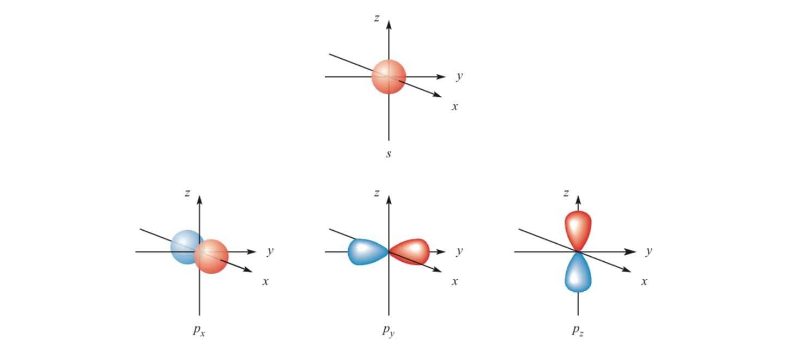
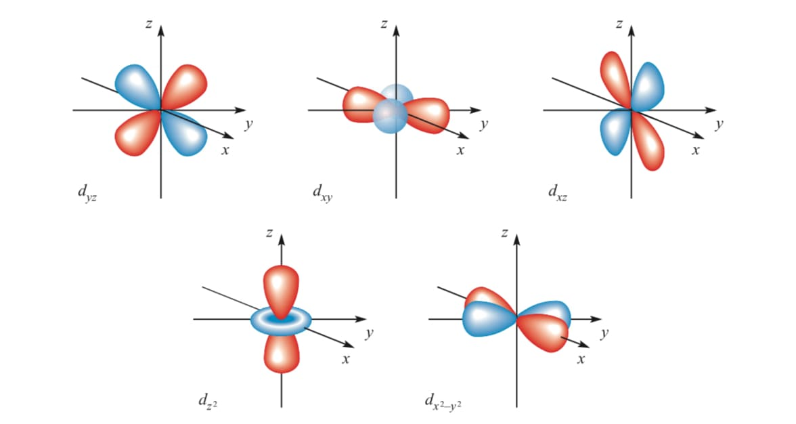
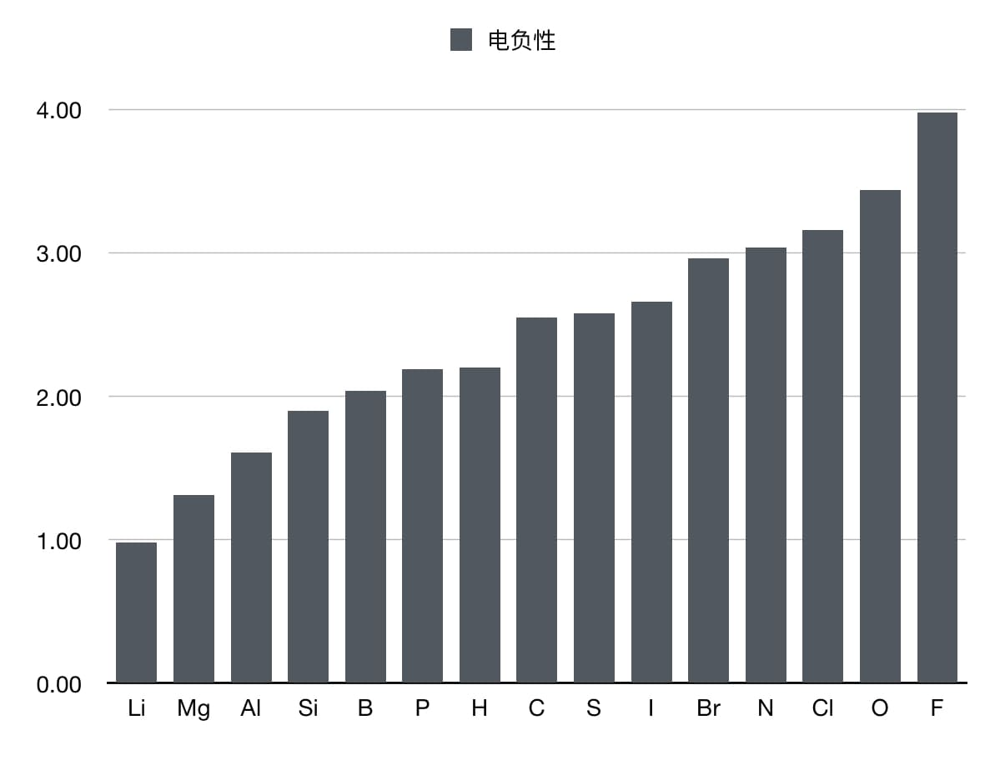
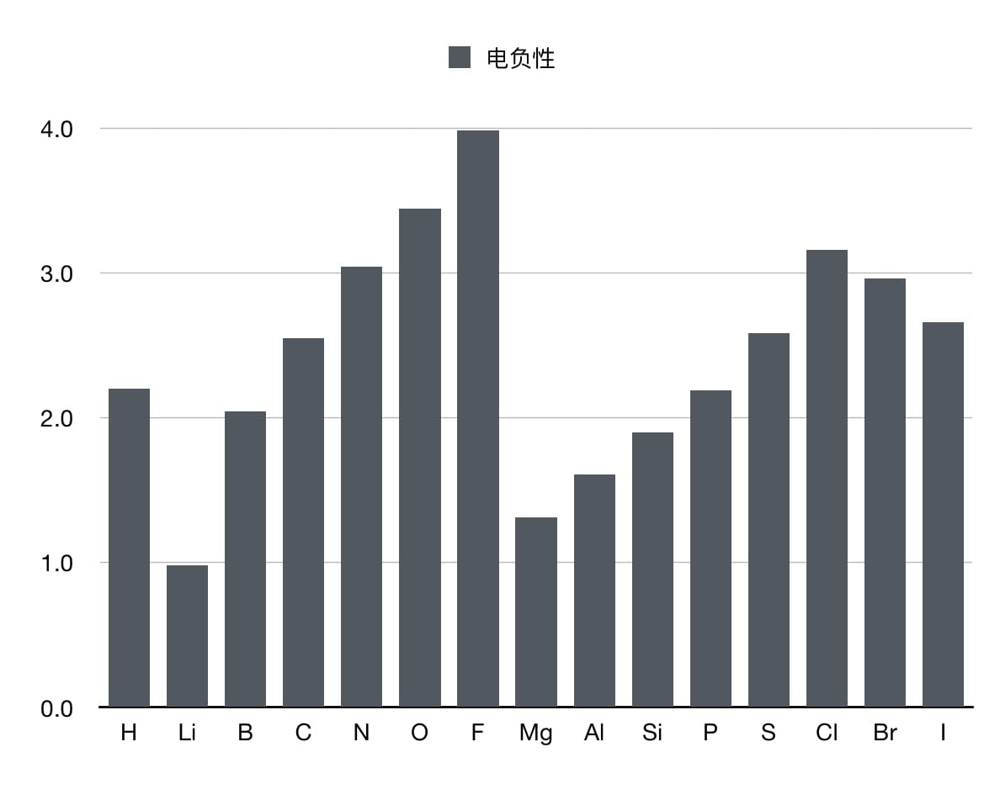

# 原子和元素

## 1.1 原子

原子一般由三种粒子组成。

1. **质子（Proton）**：质子带有正电荷，位于原子核中。质子的数量决定了一个元素的原子序数，并且对元素的化学性质有决定性影响
2. **中子（Neutron）**：中子不带电，和质子一样，也位于原子核中。中子的数量会影响原子的质量和稳定性，但不影响元素的化学性质
3. **电子（Electron）**：电子带负电荷，围绕原子核运动。电子的数量通常与质子相等，这样原子整体呈中性

关于中子数目对原子核稳定性的影响，在较重原子核中较为明显，感兴趣的可以参考稳定岛理论。

> 稳定岛理论是核子物理中的一个理论推测，核物理学家推测原子核的质子数和中子数为“幻数”的放射性超重元素会特别稳定。假如这个猜测正确的话，那么某些特定的超重元素的同位素将比其他同位素更稳定，这些同位素的放射性衰变过程可能会相对非常慢。
> 
> 稳定岛理论最初是格伦·西奥多·西博格提出的。他认为原子核中的核子与原子核外的电子一样是分布在不同的”壳层”中的，实际上每个壳层就是一组相近的量子能级。不同壳层之间的能量差则比较大。假如一个原子核中的质子和中子正好填满一个壳层的话，那么每个核子之间的结合能就会达到最大，因此这个原子核就最稳定，比其附近核子没有填满或超出一个壳层的同位素要稳定。
> 
> 饱和的壳层的中子和质子数被称为“幻数”（也称为“魔数”），中子和质子数同时为幻数的原子核被称为“双幻核”。一个可能的中子魔数是184，可能的质子魔数是114、120和126，也就是说，298Fl、304Ubn和310Ubh可能比较稳定。这些同位素至今为止未能被合成。但Fl的带有114个质子和少于184个中子的同位素比元素周期表中邻近的元素的同位素的衰变要慢得多。
> 
> 处于稳定岛的元素非常可能依然是放射性元素，只是它们相对于其附近的同位素“比较稳定”，虽然有人怀疑有些同位素的半衰期可能大于一日或甚至更长，但也可能小于一秒，而在目前发现的元素中，289Fl的半衰期为2.6秒，285Cn的半衰期为32秒，293Lv的半衰期有0.08秒，跟附近的元素比起来是很惊人的。

## 1.2 电子

这里把电子单独摘出来详细讲解，在化学中对电子的研究是很关键的。

### 1.2.1 电子与成键

化学反应主要由原子的电子参与。原子通过转移或共用电子来形成化学键。根据电子的配置，原子会倾向于以某种特定的方式与其他原子结合，形成分子或化合物。

* **离子键**：当一个原子失去电子，另一个原子获得电子时，它们之间形成离子键。典型的例子是钠和氯反应形成氯化钠（NaCl）
* **共价键**：当两个原子共享电子时，它们之间形成共价键。例如，氢气分子（H-H）中的两个氢原子通过共享电子形成共价键
* **金属键**：金属原子之间的键合是通过自由电子形成的，这些电子能够自由流动，这赋予了金属良好的导电性

### 1.2.2 电子效应

在原子中，电子受到来自原子核的吸引力，同时也受到其他电子的排斥力。在量子力学的框架下，描述电子行为的波函数不仅与电子的能量有关，还与电子在原子中的空间分布以及其他电子的存在影响有关。电子钻穿效应和屏蔽效应是描述电子在原子内部如何相互作用以及它们如何在电场中行为的两个重要概念。

处于某轨道上的电子一般同时产生屏蔽效应和钻穿效应。屏蔽效应描述的是该电子对别的电子排斥（屏蔽）能力的大小，而钻穿效应是该电子有效回避其它电子的屏蔽作用的能力大小，最终电子的能量高低是两者共同作用的结果，因此它们的本质都是一种能量效应。

屏蔽效应主要指内层电子对价（外）层电子的排斥，整体减弱核吸引。钻穿效应则是从被屏蔽电子的视角，描述其通过轨道形状主动部分避开屏蔽的能力。二者共同决定有效核电荷。

#### §电子钻穿效应

钻穿效应是指在多电子原子中，由于不同原子轨道（尤其是同一主量子数 $n$ 下的 $s$ 、 $p$ 、 $d$ 、 $f$ 亚层）电子云径向分布的差异，该轨道上的电子有不同概率出现在靠近原子核的区域，从而部分避开（或“穿透”）内层电子的屏蔽作用，感受到更大的有效核电荷（ $Z^*$ ），导致轨道能量降低的现象。

核心机制为电子波函数允许电子出现在原子任何位置。 $s$ 轨道电子云球对称、无节点角度分布，在近核处概率密度较高（径向概率分布图上有小峰靠近核）， $p$ 、 $d$ 、 $f$ 轨道形状复杂，在近核处概率密度较低。

钻穿能力顺序（ $n$ 相同）： $ns > np > nd > nf$

能量影响：钻穿效应越大，该轨道电子感受到的屏蔽越不完全， $Z^*$ 越大，轨道能量越低（更稳定）。

钻穿效应还解释能级交错如 $4s$ 轨道钻穿强于 $3d$ ，导致 $E_{4s} < E_{3d}$ ，填充顺序 $4s$ 先于 $3d$ 。

钻穿效应有助于解释同一主量子数下不同亚层的能量差异（能级分裂），以及不同主量子数间轨道的能量交错现象。

#### §电子屏蔽效应

在原子核中，由于内层电子对外层电子施加的排斥作用。外层电子感受到的来自原子核的吸引力被“屏蔽”了。因此，外层电子的有效核电荷比原子核的实际电荷要小。这种由于其它电子对某一电子的排斥作用，而抵消了一部分核电荷对电子的吸引力的作用，称为屏蔽效应（或作用），而把被其他电子屏蔽后的核电荷称为有效核电荷。

屏蔽效应的机制是内层电子的影响，当一个电子接近原子核时，它会部分地“遮挡”原子核对外层电子的吸引力。这个影响就是屏蔽效应。内层电子的数量越多，外层电子受到的核吸引力就越弱。

电子感受到的电场不是来自于整个原子核的电荷，而是由原子核的电荷减去其他电子的屏蔽效应后的“有效核电荷”决定的。有效核电荷 $Z^*$ （也可以写成 $Z_{\text{eff}}$ ）可以描述电子实际感受到的电荷数值。

有效核电荷的基本公式为：

$$
Z^* = Z - S
$$

$$
Z^* = Z - \sigma
$$

$Z$ 是原子核的实际电荷数（即质子数），而 $S$ 是屏蔽常数，代表其他电子对外层电子的屏蔽作用， $\sigma$ 叫屏蔽系数，它代表了其它电子对所选电子（又称目标电子）的排斥作用大小。

$\sigma$ 值越大，表示目标电子受到的屏蔽作用就越大。规定处在目标电子的内层以及同层能级上的电子才会对目标电子产生屏蔽效应。而且电子离核的远近不同,所处的轨道 形状不同,则屏蔽效应大小也就不同。

屏蔽常数 $\sigma$ 是量化屏蔽效应的参数，表示所有内层电子对指定电子的总屏蔽贡献。 $\sigma$ 越大，该电子感受到的核吸引力越弱。

$$
S = \sum \sigma_i
$$

贡献值取决于屏蔽电子与被屏蔽电子的相对位置

电子能量E：E = −13.6 (Z*)² / n²（eV）。Z*越大，|E|越大，电子越稳定（能量越低）。

影响 $\sigma$ 数值的因素：

1. **屏蔽电子的数量**：内层电子越多， $\sigma$ 越大，因为是贡献累加
2. **被屏蔽电子与核的距离**： $n$ 越大，内层电子屏蔽越完全， $\sigma$ 越大。
3. **电子云的穿透性**
    * 穿透性：电子接近原子核的概率， $l$ 越小，穿透性越强
    * 内层电子对价电子的屏蔽：穿透性强的电子（如 $s$ ）屏蔽作用更强
4. **同一壳层内亚层差异**： $n$ 相同， $l$ 越大，电子云越分散、远离核，对内层电子的屏蔽作用越小，但对自身外层电子的屏蔽作用也有相应调整

趋势规律：

1. **同一周期**（从左到右）
    * $Z$ 增大，新增电子进入同一壳层，屏蔽不完全
    * $Z^*$ 增大 → 原子半径减小 → 电负性/电离能增大
2. **同一主族**（从上到下）
    * $n$ 增大，内层电子增多， $\sigma$ 显著增大
    * $Z^*$ 略增（但 $n^2$ 效应主导） → 原子半径增大 → 电离能减小
3. **过渡元素**： $d$ 电子屏蔽弱（ $l$ 大，穿透差）， $Z^*$ 随 $Z$ 增加更快
4. **能量顺序**（多电子原子）： $ns < np < nd < nf$ （屏蔽+穿透综合： $s$ 穿透强但屏蔽强，导致能量较高？实际 $ns$ 能量低于 $np$ ）

澄清可能的误区：

1. σ是“其他电子对该电子的屏蔽”，该电子本身不贡献σ
2. σ大 → Z*小 → |E|小 → 能量越高（更易电离）
3. n相同时，l越大，电子云越分散，屏蔽作用减小（对内层）
4. 屏蔽完全（σ=Z-1）不存在，仅内层满壳时近似完全，同层屏蔽不完全
5. 视角区分清楚：产生屏蔽是内层对价层，感受到屏蔽是价电子的σ导致Z*减小

总结一下，屏蔽效应会影响：

1. **电子能量**
2. **原子大小**：由于外层电子受到的屏蔽作用，导致原子大小增加。外层电子与核的吸引力较弱，因而原子会膨胀，尤其是当原子中有更多内层电子时。
3. **化学反应性**：屏蔽效应也影响元素的化学反应性。屏蔽效应强的元素更难与其他物质发生反应，因为它们的外层电子不容易被外界环境所影响

有效核电荷数的意义：

1. **原子大小**：有效核电荷数越大，电子受到的吸引力越强，原子通常越小。反之，有效核电荷数越小，电子被屏蔽的作用越强，原子越大
2. **电离能与电子亲和能**：有效核电荷数越大，电子与原子核的结合越紧密，电离能越高。有效核电荷数小的元素更容易失去电子，因此其电离能较低
3. **化学反应性**：有效核电荷数还影响元素的化学反应性。有效核电荷数较大的元素，其外层电子更不容易被移除，化学反应性较弱；而有效核电荷数较小的元素，外层电子较容易发生化学反应
4. **周期性变化**：有效核电荷数会随着周期和族的变化而变化。横向上，随着原子序数的增加，有效核电荷数通常也会增加；纵向上，随着主量子数 $n$ 的增加，外层电子的有效核电荷数通常较小

#### § Slater's Rules

斯莱特规则是一种简单方法，用来计算这种屏蔽效应。它由科学家斯莱特在1930年提出，能帮助我们预测原子的电子构型和电离能（移除电子需要的能量）。这个规则不是完美的理论计算，而是基于实验的近似，适合理解原子行为。

1. **写出电子构型**：用分组形式，比如氮（N）：(1s²) (2s², 2p³)
2. **选定目标电子**：忽略它右边（更高能级）的所有电子
3. **计算屏蔽S**（分两种情况）
   * **对于s或p电子**（最外层常见）
     * 同组其他电子屏蔽0.35（1s组例外，为0.30）
     * n-1组（前一层）屏蔽0.85
     * n-2及更低组屏蔽1.00（完全屏蔽，像质子一样）
   * **对于d或f电子**（过渡金属常见）
     * 同组其他电子屏蔽0.35
     * 所有更低组屏蔽1.00
4. **算Z_eff**：Z_eff = Z - S

例子

* **氮原子（N，Z=7）的2p电子**
   * 构型：(1s²) (2s², 2p³)
   * 目标：一个2p电子
   * S = 1s组（2个电子 × 0.85） + 同组其他4个电子（4 × 0.35） = 1.7 + 1.4 = 3.1
   * Z_eff = 7 - 3.1 = 3.9
   * 2p电子感受到的核电荷像3.9个质子，而不是7个

* **硼原子（B，Z=5）的2p电子**
  * 构型：(1s²) (2s², 2p¹)
  * S = 1s组（2 × 0.85） + 同组其他2个电子（2 × 0.35） = 1.7 + 0.7 = 2.4
  * Z_eff = 5 - 2.4 = 2.6
  * 这解释了为什么硼的价电子容易参与化学反应

* **溴原子（Br，Z=35）的4p电子**
  * 构型：(1s²) (2s²,2p⁶) (3s²,3p⁶) (3d¹⁰) (4s²,4p⁵)
  * S ≈ 28.9（计算包括多层屏蔽）
  * Z_eff = 35 - 28.9 = 6.1

* **溴原子的3d电子**
  * S ≈ 21.15。
  * Z_eff = 35 - 21.15 = 13.85。
  * d电子屏蔽规则不同，更低层完全屏蔽

这只是个模型，不是精确计算。

#### § 惰性电子对效应

惰性电子对效应是指在p区元素化合物中，最外层s层电子倾向于保持非电离或非共享状态，即不参与键合。这种效应与第III、IV、V、VI族元素的最大可能氧化态减去2的氧化价稳定性沿族向下增加的趋势密切相关。该效应可通过“相对论性效应”来解释：对于核电荷数较大的原子，其1s层电子受到核的强烈吸引，在核附近高速运动；根据相对论效应，电子质量增加，导致1s轨道收缩。由于s轨道的钻穿效应，6s轨道也随之收缩，从而使6s层电子表现出异常的惰性。

> 在周期表中，该效应导致元素沿族向下时，低氧化态化合物稳定性增加，而高氧化态化合物稳定性下降。具体表现如下：
> 
> **第III族元素**：一价铊（Tl⁺）稳定，而三价铊（Tl³⁺）相对活泼且罕见。三价铊具有强氧化性，易被还原为一价铊。一价化合物的稳定性沿族向下增加，三价化合物的稳定性则沿族向下减少。总体上，第III族元素沿族向下越不易表现出高化合价。
> 
> **第IV族元素**：二价化合物的稳定性沿族向下增加，四价化合物的稳定性沿族向下减少。例如，二氧化铅（PbO₂）不稳定，是极强的氧化剂，能将盐酸氧化成氯气，或将锰离子氧化成高锰酸根离子；相比之下，一氧化铅（PbO）更稳定。四氯化铅（PbCl₄）在50°C即分解，四溴化铅（PbBr₄）和四碘化铅（PbI₄）在常温下甚至不存在。三氯化铊（TlCl₃）在155°C下分解。
> 
> **第V族和第VI族元素**：类似趋势，低氧化态稳定性增加，高氧化态稳定性减少。

元素的化学性质主要取决于价电子结构：有效核电荷（Z*）越大、原子半径越小，价电子越惰性。使用Slater规则计算Z*和ΔZ（与上周期比较）显示，除IA和IIA族外，第四和第六周期多数族元素的Z*较高；第二周期也表现出微弱惰性。

> 原因分析
> 
> **第四周期**：3d轨道的填充（n-1内层）导致屏蔽效应弱、钻穿效应强，使4s电子惰性增强，元素性质差异显著（如金属不活泼、低价态稳定）。
> 
> **第六周期**：4f轨道的填充（n-2次内层）屏蔽更弱，Z*增加更多，惰性效应更突出。
> 
> **第二周期**：内层电子少、半径小，价电子受核吸引强，表现出对角线关系和电负性特殊。
> 
> **例外情况**：IA、IIA和IIIB族无明显惰性，因电子构型无特殊变化；钯（Pd）异常高Z*源于其稳定的4d¹⁰5s⁰构型。

规律性揭示：

当核外电子排布首次出现p、d、f亚层时，有效核电荷增加，导致第二、四、六周期的p区、d区和ds区元素价电子惰性增强。效应强度按第二、四、六周期递增，因为p、d、f轨道的发散性增大、屏蔽减弱、电子容纳增多，对Z*贡献渐大。整体上，周期表元素性质呈周期性，但该效应增加了规律的复杂性，受化合元素和外部条件影响。

> 6s²惰性电子对效应的特定解释
> 
> 6s²惰性电子对效应特指在重元素（如过渡金属和镧系元素）中，6s轨道的电子在化学反应中表现出不活跃特性，常称为“惰性电子”。这可以通过屏蔽效应和钻穿效应解释。
> 
> 在周期表中，如铯（Cs）等重元素的外层电子构型为6s²。尽管6s轨道电子离核较远（主量子数n=6），但内层电子（尤其是3d和4d轨道）提供强烈的屏蔽效应，减弱了6s电子与核的吸引力。这些电子位于相对稳定的能级上，不易参与化学反应。

> 化学反应中的惰性现象
> 
> **化学稳定性**：由于屏蔽作用，6s²电子活性较低，常不直接参与反应。例如，在某些过渡金属中，6s²电子不易脱离，导致整体反应性较低。
> 
> **异常现象**：在特定条件下（如进入更高氧化态时），6s²电子可能参与反应，但通常需外部能量激活。

## 1.3 量子力学基础

对原子描述更加精确的方法有量子力学，我们可能或多或少听过这个词，它没有那么遥不可及，我们也可以了解一二的。它的基本内容之一是描述粒子状态的量子数。

对于电子在原子中的运动，量子数用来描述电子的不同性质，包括电子的能量、角动量、轨道形状、方向等。总共有四个量子数，它们共同确定了电子在原子中的状态。

### 1.3.1主量子数

主量子数 $n$ 描述的是电子所在的能层。它决定了电子的平均距离与原子核之间的距离。主量子数可以是任何正整数，即（ $n = 1, 2, 3, \dots$ ）数值越大，电子的能量越高，离原子核越远。

* $n = 1$ 对应的是原子的最内层电子，能量最低
* $n = 2$ 是第二能级，能量高于第一能级
* 以此类推

主量子数越大，电子所在的轨道就越大，能量也越高。

### 1.3.2 角量子数

又名角动量量子数，也可以叫电子亚层。 $l$ 描述了电子轨道的形状。这个量子数的取值依赖于主量子数 $n$，其范围是从 $0$ 到 $n-1$ 的整数。每个不同的 $l$ 值对应一个不同类型的轨道：

* $l = 0$ 对应 **s轨道**（球形轨道）
* $l = 1$ 对应 **p轨道**（哑铃形轨道）
* $l = 2$ 对应 **d轨道**（花瓣形轨道）
* $l = 3$ 对应 **f轨道**（更复杂的形状）




### 1.3.3 磁量子数

磁量子数 $m_l$ 描述电子轨道的空间取向，也就是轨道相对于外部磁场的方向。它的取值范围为 $-l$ 到 $+l$，包括零。例如，如果 $l = 2$，则 $m_l$ 的取值可以是 $-2, -1, 0, 1, 2$ 。磁量子数告诉我们电子轨道在空间中的方向（通常是围绕原子核的空间方向）。

同一电子亚层内的各原子轨道，在没有外加磁场的作用下，能量是相等的，称为等价轨道或简并轨道。

### 1.3.4 自旋量子数

自旋量子数 $m_s$ 描述的是电子的自旋（也就是电子自转），它决定了电子的磁性。电子的自旋只有两种可能的状态：**顺时针旋转（$+1/2$）**和**逆时针旋转（$-1/2$）**。因此，自旋量子数 $m_s$ 只能取两个值：

* $m_s = +1/2$
* $m_s = -1/2$

### 1.3.5 规律总结


| n   |     | l   |     | m             | 轨道数 |     | 电子数 |     |
|-----|-----|-----|-----|---------------|-----|-----|-----|-----|
| K   | 1   | s   | 0   | 0             | 1   | 1   | 2   | 2   |
| L   | 2   | s   | 0   | 0             | 1   | 4   | 4   | 8   |
|     |     | p   | 1   | 0, ±1         | 3   |     | 6   |     |
| M   | 3   | s   | 0   | 0             | 1   | 9   | 2   | 18  |
|     |     | p   | 1   | 0, ±1         | 3   |     | 6   |     |
|     |     | d   | 2   | 0, ±1, ±2     | 5   |     | 10  |     |
| N   | 4   | s   | 0   | 0             | 1   | 16  | 2   | 32  |
|     |     | p   | 1   | 0, ±1         | 3   |     | 6   |     |
|     |     | d   | 2   | 0, ±1, ±2     | 5   |     | 10  |     |
|     |     | f   | 3   | 0, ±1, ±2, ±3 | 7   |     | 14  |     |

发现规律了吗，原子外的排布是很有条理的，我来总结一下：

全充满电子数是轨道数的两倍，因为一个轨道上最多两个电子。且轨道数是等差数列，有：

$$
2l + 1 = n^2
$$

## 1.4 元素 原子序数 元素符号

具有一定核电荷数（等于核内质子数）的原子称为一种（化学）元素。按(化学)元素的核电荷数进行排序，所得序号叫做原子序数。每一种元素有一个用拉丁字母表达的元素符号，在不同场合，元素符号可以代表一种元素，或者该元素的一个原子，也可代表该元素的 1 mol 原子。

需注意的是：

* 元素是由具有相同质子数的原子构成的物质
* 元素是化学物质最基本的组成单位
* 每种元素的所有原子都有相同数量的质子
* 元素的种类决定了其化学性质和物理性质

所有已命名的元素都有一个单音节中文名称，为了国际交流，面向世界，熟悉元素的英文名称是必要的。但应注意，英语中有些元素的名称与元素符号的来源相去甚远，例如：

* Pb (lead)
* Au (gold)
* Ag (silver)
* K (potassium)
* Na (sodium)

另外个别国家至今仍采用某些非国际通用的元素符号，例如碘，有些欧洲国家以 J 为其符号。

## 1.5 核素 同位素 同位素丰度

具有一定质子数和一定中子数的原子称为一种核素。已知的核素品种超过2000种。有两类核素：一类是稳定核素，它们的原子核是稳定的；另一类是放射性核素，它们的原子核不稳定，会自发释放出某些亚原子微粒等，而转变为另一种核素。

具有相同核电荷数、不同中子数的核素属于同一种元素，在元素周期表里占据同一个位置，互称同位素。大多数同位素的符号借用核素符号，也可以省略核素符号左下角的质子数。

某元素的各种天然同位素的分数组成（原子百分比）称为同位素丰度。

## 1.6 元素周期律 元素周期系 元素周期表

元素周期律就是：随核内质子数递增，核外电子呈现周期性排布，元素性质呈现周期性递变。元素周期性的内涵极其丰富，其中最基本的是：随原子序数递增，元素周期性地从金属渐变成非金属，以稀有气体结束，又从金属渐变成非金属，以稀有气体结束，如此循环反复。所以元素周期表展示了元素之间的周期性变化规律。

元素周期系又称元素周期表，是以原子核电荷数递增或相对原子质量等标准排列化学元素的系统性分类方式，元素性质在排列中呈现周期性变化规律。 

#### § 金属 非金属 类金属

所有元素分为三类：

* **金属**：金属位于元素周期表的左侧和中部，通常具有良好的导电性、导热性和延展性。常见的金属包括铁、铜、铝等
* **非金属**：非金属位于周期表的右侧，通常具有较低的熔点和沸点，且不导电。常见的非金属包括氧、氮、氯等
* **类金属**：半金属位于金属和非金属之间，它们在某些条件下表现出金属的性质，而在其他条件下则表现出非金属的性质。例如硅、砷

类金属又译半金属，但为了精确区别这类元素的性质，术语半金属对应的英语应为semimetal或 half-metal；前者在能带理论中，是指导带和价带之间相隔很窄的材料；后者在自旋电子学中，是指对于自旋为某一方向的电子表现为导体，但是对于自旋为另一方向的电子表现为半导体或绝缘体的材料，或详称自旋半金属。

## 1.7 元素周期性

元素周期表中，随着元素的序数增加，它们的电子结构也呈现出周期性的变化。每个周期内，元素的化学性质逐渐变化，表现为：

* **从左到右**：元素的电负性（吸引电子的能力）逐渐增大，原子半径减小，金属性降低
* **从上到下**：元素的电负性逐渐减小，原子半径增大，金属性增强

例如，碱金属（如钠、钾）在化学反应中非常活泼，它们倾向于失去一个电子形成阳离子。相比之下，贵金属（如金、银）则非常稳定，不容易发生化学反应。

### 1.7.1 原子半径

原子半径是原子中原子核与最外层电子之间的平均距离。它是衡量原子大小的一个重要参数。原子半径不仅与原子的核电荷数（即质子数）有关，还与外层电子之间的排斥作用有关。

原子半径通常指原子的尺寸，并不是一个精确的物理量，并且在不同的环境下数值也不同。一个特定的原子的半径值和所选用的原子半径的定义相关，而在不同的环境下给原子半径不同定义比统一的定义更合适。

术语原子半径本身就有疑问：可能指一个自由原子的尺寸，或者可能用作原子（包括分子中的原子和自由原子）尺寸不同测量方式的一个笼统的术语。在下文中，这个术语还包括离子半径，主要是因为共价键和离子键区别不大。而原子的定义“能区分出化学元素的最小粒子”本身就比较含糊，包括了自由原子以及与其它相同或不同原子一起组成化学物的原子。除了离子半径，其他可能指代的半径值包括玻尔半径，范德华半径，共价半径和金属半径等。

原子半径完全由电子决定，原子核的大小为是电子云的十万分之一。值得注意的是原子核没有固定的位置，而电子云没有固定的边界。

虽然有上述的困难，目前还是有很多的测量原子（包括离子）的方法，这些方法通常基于实验测量和计算方式的结合。目前普遍认为原子像一个球体，尺寸在30–300pm之间，在元素周期表中的原子半径变化有规律可循，从而对元素的化学特性造成影响。

常见的定义：
1. 范德华半径：晶体中，没有成键而是通过范德华力结合的两原子，其核间距的一半即为范德华半径（又称范氏半径）
2. 离子半径：离子键长等于两离子半径的和
3. 金属半径：金属晶体中，相邻金属原子核间距一半即为金属半径
4. 玻尔半径：由玻尔原子模型推测的最低能量电子轨道的半径

原子半径在同一族内从上到下递増，在同一元素周期内从左到右递减。造成这种现象的部分原因是电子的分布不是完全自由的。原子内部的电子按照电子层排列，每个电子层只能容纳固定数量的电子。元素周期表的每个一新的周期和一个新的电子层对应，离原子核也越来越远。

原子核的电荷是另一个和原子半径相关的重要因素，随着原子序数Z的增加，原子核电荷增加。原子核的电荷是正的，吸引负电子。在一个元素周期内，原子核的电荷增加，而新增加的电子在同一层里，导致电子层的半径减小（对于主族元素来说，同周期电子层数相同的原子，随着原子序递增，后续电子填充在最外层，内层电子没有变化，内层电子对最外层电子的排斥力变化不大，反而因核电荷数的增加，原子核对最外层电子的吸引力也增加，导致最外层电子运动区域往核靠近，原子半径减小。），从而影响到原子半径的减小。

影响因素：

* **周期变化**：在同一周期内，随着原子序数的增加，原子核的电荷增多，外层电子受到的吸引力增大，从而使原子半径减小
* **族变化**：在同一族内，随着主量子数 n 的增大，原子半径增大，因为电子层数增加，外层电子距离原子核更远，屏蔽效应也增强
* **屏蔽效应**：内层电荷对外层电荷的排斥力，将外层电荷“向外推”

原子半径的具体计算公式比较复杂，但有一些经验公式可以提供近似值。例如，有效核电荷数 $Z^*$ 通常影响原子半径的大小。

$$
r \propto \frac{1}{Z^*}
$$

### 1.7.2 电离能

电离能是指将一个气态原子中的一个电子完全移除所需的最小能量。电离能可以反映出电子与原子核之间的结合程度。电离能越高，表明电子越难以被移除。

影响因素：

* **周期变化**：在同一周期内，原子核电荷增加，原子半径减小，电子受到的吸引力增大，因此电离能通常增加
* **族变化**：在同一族内，随着主量子数 $n$ 的增加，外层电子距离原子核更远，电离能通常减小

电离能与电子之间的库仑力有关。

### 1.7.3 电子亲合能

**电子亲合能**是指一个气态原子吸引一个电子时所释放的能量。电子亲合能反映了原子对电子的吸引能力。通常，电子亲合能为负值，表示吸收一个电子后原子变得更加稳定。

影响因素：

* **周期变化**：周期内，从左到右，原子核电荷增加，电子层数不变，导致原子对电子的吸引力增大，因此电子亲合能通常增加
* **族变化**：族内从上到下，外层电子数增多，屏蔽效应增强，电子亲合能通常减小

电子亲合能公式：

$$
EA = E(\text{atom + electron}) - E(\text{atom})
$$

其中，$EA$ 是电子亲合能，$E(\text{atom + electron})$ 是原子接受电子后的总能量，$E(\text{atom})$ 是原子本身的能量。

### 1.7.4 电负性

电负性是指一个原子在化学反应中吸引电子的能力。电负性强的原子，能更强地吸引共享电子对。

影响因素：

* **周期变化**：在同一周期中，随着原子核电荷的增加，原子对电子的吸引力增大，因此电负性增加
* **族变化**：在同一族中，由于原子半径增大，电子的吸引能力降低，因此电负性减小

#### § 鲍林电负性
电负性通常通过不同的经验方法给出，常用的鲍林电负性（Pauling scale）是由化学家Linus Pauling提出的，虽然没有直接的公式，但可以通过已知元素的电负性数据来进行比较，也可以通过与其他电负性的线性关系得到，下面会讲到。

一般来说，电负性随原子序数的增加而增大。常用的电负性数据表格可以用来参考。另外，键的偶极矩和两个原子的电负性之差数值上相差很小。





电负性还有其他的定义，也可以了解一下。

#### § 马利肯电负性

马利肯电负性是由化学家Robert S. Mulliken提出的一种电负性度量方法，它基于一个原子的电子亲和能和电离能。其计算公式为：

$$
\chi_{\text{Mulliken}} = \frac{I + A}{2}
$$

其中：

* $I$ 是原子的电离能（将一个电子从原子中移除所需的能量）
* $A$ 是原子的电子亲和能（一个电子加入到原子时释放的能量）

鲍林电负性和马利肯电负性之间有一个线性关系。虽然两者的计算方式不同，但它们的数值趋于一致，尤其是在元素周期表中的大部分元素。

理论上，马利肯电负性可以通过以下公式和鲍林电负性建立线性关系：

$$
\chi_{\text{Mulliken}} \approx 0.75 \chi_{\text{Pauling}} + 0.125
$$

这表明，如果知道某个元素的鲍林电负性，可以通过上述公式得到其马利肯电负性，反之亦然。

#### § Allred-Rochow电负性

Allred-Rochow 电负性是由Allred和Rochow于1958年提出的一种基于原子半径的电负性模型。这个模型假设，原子越小，原子核对外层电子的吸引力越强，因此电负性越大。Allred-Rochow电负性的计算公式如下：

$$
\chi_{\text{AR}} = \frac{0.359 \cdot Z^*}{r^2}
$$

其中：

* $Z^*$ 是有效核电荷，表示原子核对外层电子的有效吸引力
* $r$ 是原子的共价半径，表示原子外层电子的平均距离

Allred-Rochow 电负性特点：

* Allred-Rochow电负性与原子的半径和有效核电荷密切相关，说明原子半径越小，电负性越大
* 它的一个重要特点是考虑了原子半径的变化，因此它更能反映原子结构的影响

#### § 对比各种电负性

* **马利肯电负性**主要基于电离能和电子亲和能，计算简单，反映了电子吸引力的综合因素
* **鲍林电负性**是通过元素间的化学键能差异来定义，广泛用于化学研究
* **Allred-Rochow电负性**则主要通过原子半径和有效核电荷来计算，强调了原子大小和核电荷对电负性的影响

这三种电负性尺度都可以帮助我们理解元素的化学性质，尤其是在元素之间形成化学键时的行为。

#### § 电负性标度的研究阶段

第一阶段（传统标度，强调原子性质参数）
> 
> 使用电离能、电子亲合能、有效核电荷、原子半径等估算电负性。代表性标度包括：
> 
> Pauling标度：基于键能差，Δ = E(A-B) - [E(A-A) + E(B-B)]/2，χ_A - χ_B = 0.102√Δ。主要用于判断键极性，但有缺陷（如N<Cl但不符合某些规则，无量子基础）
> 
> Mulliken标度：χ_M = (I + EA)/2，与Pauling近似相关（χ_P ≈ 1.35χ_M - 1.37）。解释极性时有矛盾（如NH3、CH4）
> 
> Gordy标度：引入静电势概念，χ = 0.62(Z'/r) + 0.50，但计算屏蔽核电荷困难
> 
> Sanderson标度：基于稳定比R_s = D_E / D_{E0}，χ = (0.21R_s + 0.77)^2。强调电子密度
> 
> Allred-Rochow标度：χ_AR = 0.359Z*/r^2 + 0.744，使用Slater规则。常用于电子分布讨论，但周期>4时偏低
> 
> 这些标度变化趋势一致，反映原子周期性

第二阶段（考虑杂化和电荷影响）
> 
> 引入电负性均衡原理，考察原子价态和电荷
> 
> Iczkowski-Margrave方法：能量E_A(σ)作为电荷σ的函数，χ_A = -dE/dσ。可简化为Mulliken形式
> 
> Hinze-Whitehead-Jaffe方法：引入轨道电负性χ_{A,j} = ∂E_A / ∂n_j，兼顾杂化和电荷，但不实用

第三阶段（绝对电负性，演绎法）
> 
> 以Parr(1978)为标志，使用密度泛函理论，绝对电负性χ = -μ ≈ (I + A)/2，μ为电子化学势
> 
> 绝对电负性：扩展到分子/离子/自由基，用于预测反应活性（而非键极性）。与Sanderson均衡原理类似，但有理论基础。绝对标度与Pauling类型用途不同，前者反映授体-受体本质，后者估键极性
> 
> Allen谱电负性：χ_s = (N_s ε_s + N_p ε_p) / (N_s + N_p)，基于光谱数据（价层平均电离能）。优势：量子基础强，包含稀有气体；解释周期表问题（如类金属定义、金属性增强、Arkel-Ketelaar三角表示键类型、氧化态限制、半径效应、电负性交错）。例如，能正确解释H2S和HI键极性（H 13.61, S 15.31, I 13.95）
> 
> Rahm标度（2019修正）：基于平均价电子结合能，覆盖1-96元素（包括f区）。图1显示周期表式数值（如H 13.6, He 24.6, Li 5.4等）。解释f区化合物键极性（如CoSb3, Ca3Hg2, Th-Al），但无法解释某些键极性（如H2S）。优势：统一方法，指导材料设计

第一阶段关注周期性，第二阶段电荷/杂化，第三阶段绝对概念。电负性从单一值向区间/基团发展。不同标度解释不同现象：Pauling估键极性，绝对预测活性，Allen/Rahm解释成键。

### 1.7.5 氧化态

TIP：氧化态就是化合价

**氧化态**是指一个元素在化合物中表现出来的电荷状态。它反映了原子失去或获得电子的能力。氧化态对于化学反应的理解至关重要。

影响因素：

* **周期变化**：同一周期内，氧化态随着元素电负性、电子结构的变化而变化。通常，金属的氧化态为正，非金属的氧化态为负
* **族变化**：族内元素的氧化态较为相似，但会随着原子半径的增大和屏蔽效应的增强而有所不同
* **6s²惰性电子对效应**

氧化态的计算并没有一个简单的公式，但通常通过已知的化学规则推断。例如，在水合离子中，水分子周围的氢和氧的氧化态通常为+1和-2。在某些化学反应中，氧化态的变化与电子的得失有关，具体的变化公式取决于反应的化学方程式。

## 参考资料

```
https://zh.wikipedia.org/zh-cn/稳定岛
https://moodle.scnu.edu.cn/pluginfile.php/54505/mod_resource/content/2/第二章第四节.pdf
https://zh.wikipedia.org/zh-cn/惰性电子对效应
https://chem.libretexts.org/Courses/Mount_Royal_University/Chem_1201/Unit_2._Periodic_Properties_of_the_Elements/2.06%3A_Slater's_Rules
http://journal.xynu.edu.cn/cn/article/pdf/preview/f1d2d9e6-1741-4938-ba4a-8f33cee6a007.pdf
https://zh.wikipedia.org/zh-hans/类金属
https://zh.wikipedia.org/zh-hans/原子半径
DOI 10.3866/PKU.DXHX201903038
ISBN 9787040552225
```

## 图像来源

```
p1 p2
CATHERINE E. HOUSECROFT AND ALAN G. SHARPE
INORGANIC CHEMISTRY p14

p3 p4
Apple Numbers App
```

## 备注

Formula 50%
$$
\LaTeX
$$